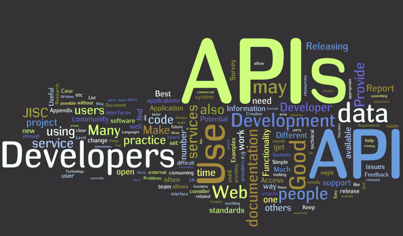

# Project---The-Ranking

1-Se extraen los datos de GitHub,para ello se hacen peticiones a la apI,utilizando el módulo request junto con funciones,para automatizar el proceso,y autentificandose con la apiKey, para obtener las pullrequest e información sobre ellas.En este caso se usaron dos direcciones de urls distintas,una de ellas a pulls y otra a issues,que es donde estaba contenida el resto de la información(en este caso los comentarios y memes).

2-Una vez extraida la información necesaria se convierte en un dataframe para limpiarla y se carga como una base de datos en Mongodb.

3-Se crea un apI la cual se conectará a nuestra base de datos para extraer la información requerida,en este caso el nombre de los estudientes,el nombre de los labs,la creación de nuevos estudiantes en la base de datos y labs aleatorios,creados mediante la función random.Todo esto se consigue mediante rutas,conectadas unas con otras y a un archivo app y server que serian los que inician nuestro proceso de conexion a localhost.

4-Una vez establecida la conexión,introduciendo el nombre de la ruta y con el parametro requerido el resultado aparecerá en nuestro localhost.